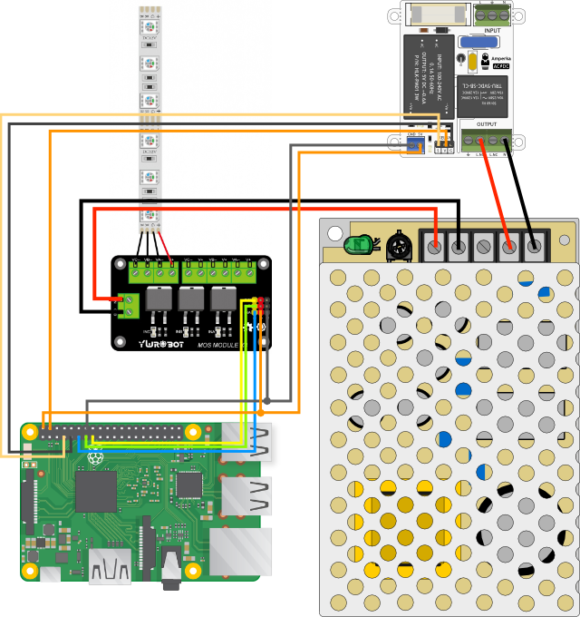

### Схема*

\* не является техническим документом

### Вещи

* [Raspberry Pi](https://www.raspberrypi.org)
* [Амперка AC/DC (Zelo-модуль)](http://wiki.amperka.ru/продукты:zelo-ac-dc)
* [YwRobot MOS Module x3](http://wiki.ywrobot.net/index.php?title=(SKU:ELB060415)3路MOS管场效应管驱动模块_IRF540)
* [Источник питания Mean Well RS-75-12](http://wiki.amperka.ru/продукты:power-mean-well)

### Программы

* [Homebridge](https://github.com/nfarina/homebridge) (HomeKit support for the impatient)
* [pi-blaster](https://github.com/sarfata/pi-blaster) (PWM on the Raspberry Pi)